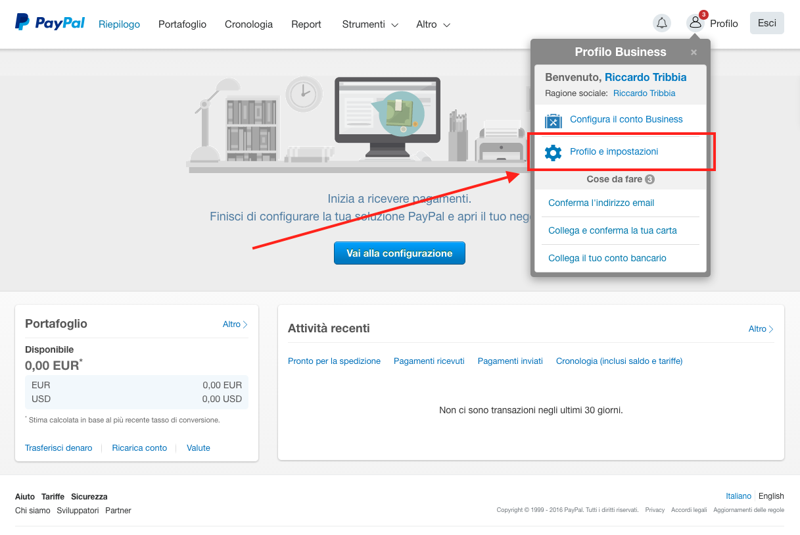
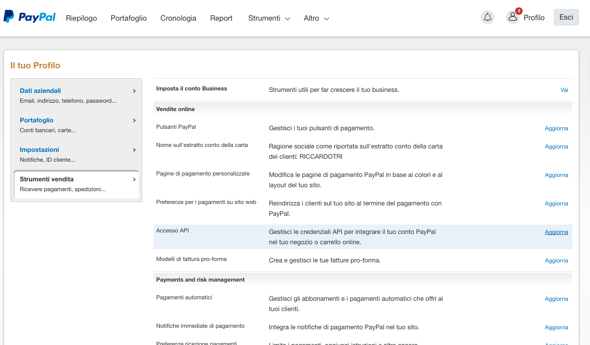
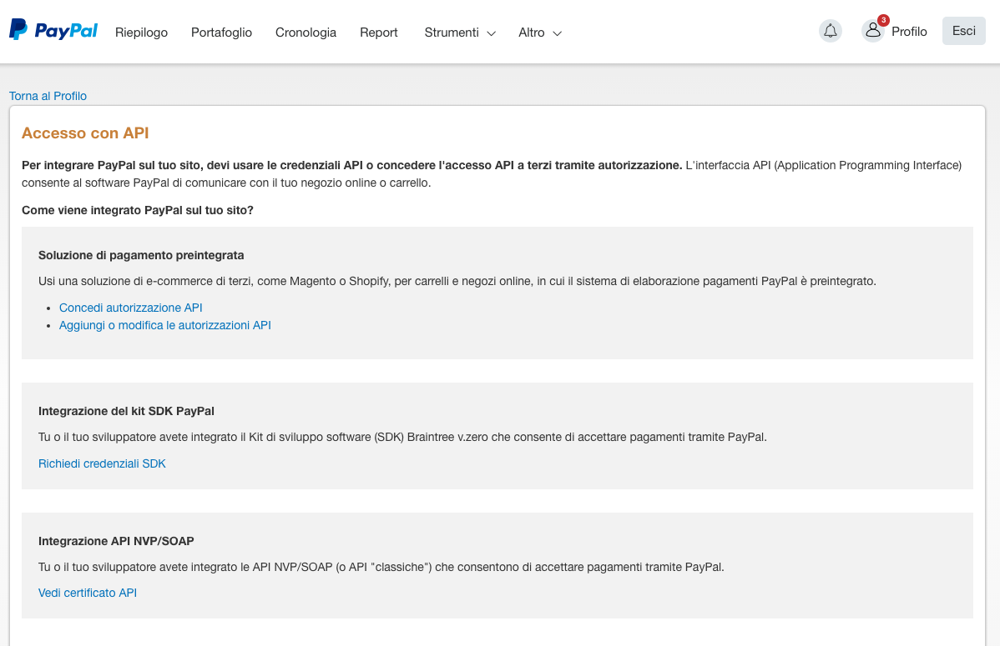
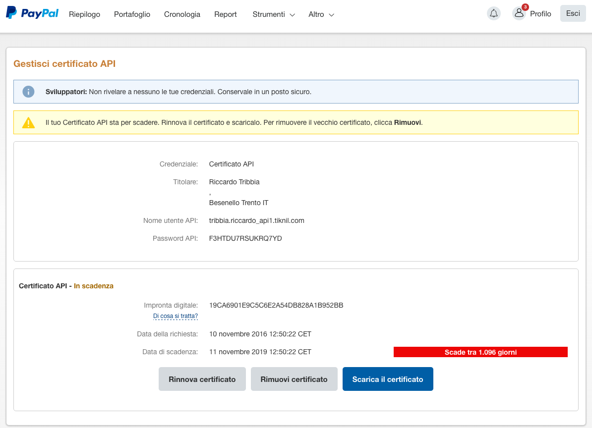

## Come mettere in produzione un backend Laravel che utilizza le "Classic API" (o NVP/SOAP API) di Paypal

Fondamentalmente bisogna predisporre 2 concetti:
1. Credenziali di accesso alle api
2. L'APP > che permette di avere l'`APP-ID` da impostare lato SDK e backend

**Prerequisiti**
* Account business PayPal verificato

### Credenziali di accesso alle api
Guida di riferimento: [https://developer.paypal.com/docs/classic/api/apiCredentials/](https://developer.paypal.com/docs/classic/api/apiCredentials/)

#### Recupero credenziali e certificato da paypal.com

* Accedi a [PayPal.com](www.paypal.com) con l'account PayPal business verificato, quindi clicca in alto a destra sull'icona del profilo e scegli "Profilo e impostazioni"

* Seleziona "Strumenti di vendita" e quindi fai click su "Aggiorna" alla voce "Accesso API"

* Nella sezione "Integrazione API NVP/SOAP" fai click su "Richiedi certificato API" o "Vedi certificato API"

* Scarica quindi il certificato sul computer. Sarà un file `cert_key_pem.txt`

* Copia le credenziali nei relativi campi del file `.env` in production: 
  - valore di "Nome utente API" in `env('PAYPAL_ACCOUNT_USERNAME')`,
  - valore di "Password API" in `env('PAYPAL_ACCOUNT_PASSWORD')`,
  - valore di "Impronta digitale" in `env('PAYPAL_ACCOUNT_SIGNATURE')`,

#### Discussione SIGNATURE o CERTIFICATO?

l'SDK Php di PayPal permette di utilizzare o la SIGNATURE o il CERTIFICATO per l'autenticazione tramite API. Per le applicazioni in produzione è consigliato l'utilizzo di un certificato per garantire una migliore sicurezza sulla transazione dei dati. 

Se ci sono problemi in locale nel test del certicato fare riferimento [a questa issue](https://github.com/curl/curl/issues/283) ed alla sua [possibile risoluzione](http://stackoverflow.com/questions/20457071/ssl-certificates-os-x-mavericks/24433135#24433135)

Funzionamento con certificato .p12 testato in locale su Mac con OS X Sierra. 

#### Predisposizione certificato cifrato p12

* Da riga di comando spostarsi nella cartella dove è presente il file `cert_key_pem.txt` ed eseguire:
```
openssl pkcs12 -export -inkey cert_key_pem.txt -in cert_key_pem.txt -out cert_key.p12
```
E inserire la password del certificato che andrà poi salvata nel file `.env` sul server in produzione nel campo `env('PAYPAL_CERTIFICATE_PASSWORD')`

Una volta predisposto il certificato `.p12` lo si deve mettere nella cartella `storage/certs`.

### Creazione dell'APP

* Accedere a [https://www.paypal-apps.com/user/my-account/applications/](https://www.paypal-apps.com/user/my-account/applications/)
* Creare una nuova app e riempire i campi del form con l'aiuto del cliente

Una volta creata e approvata l'app verrà fornito l'`APP-ID` da inserire sia lato mobile che lato server per far funzionare il tutto

